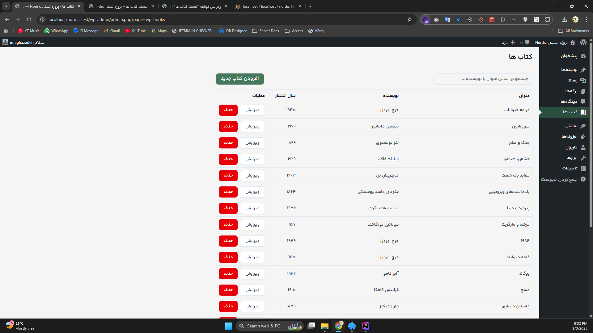
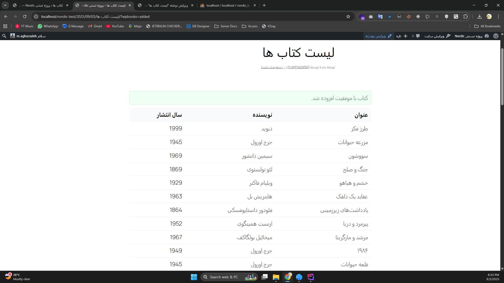
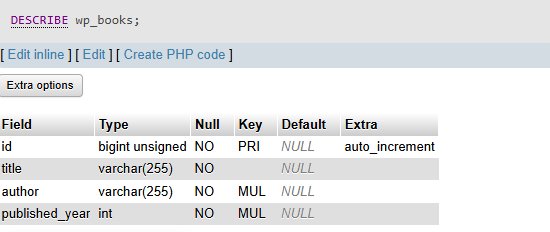
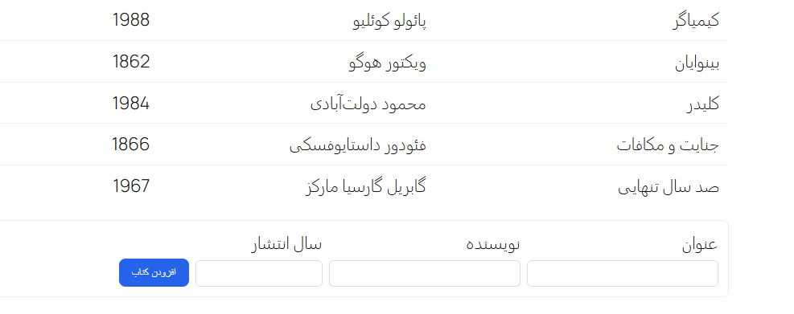

# wp-books — مستند نصب و استفاده

این مخزن شامل یک پلاگین وردپرس به نام **wp-books** است که طبق شرح تست:

- یک جدول دیتابیس (`wp_books`) می‌سازد.
- یک شورتکد `[book_list]` ارائه می‌کند که **لیست کتاب‌ها** را نمایش می‌دهد و **فرم افزودن کتاب** را
  در همان صفحه دارد.
- در محیط ادمین نیز یک صفحه‌ی React پیاده‌سازی شده است. این بخش برای تست الزامی نبود ولی اضافه شده
  تا روند توسعه و کیفیت کد بهتر دیده شود.

---

## فهرست

- [پیش‌نیازها](#پیشنیازها)
- [نصب سریع (Release + Duplicator)](#نصب-سریع-release--duplicator)
- [نصب دستی (سورس کد)](#نصب-دستی-سورس-کد)
- [راه‌اندازی محیط توسعه](#راهاندازی-محیط-توسعه)
- [استفاده از شورتکد](#استفاده-از-شورتکد)
- [ساختار پوشه‌ها](#ساختار-پوشهها)
- [امنیت و اعتبارسنجی](#امنیت-و-اعتبارسنجی)
- [Build تولیدی](#build-تولیدی)
- [اسکرین‌شات‌ها و اسکرین‌رکورد](#اسکرینشاتها-و-اسکرینرکورد)

---

## پیش‌نیازها

- WordPress 6.4+
- PHP 8.2
- MySQL 5.7+
- (برای توسعه Frontend) Node.js 22.x و npm 10.x یا pnpm
- افزونه‌های خاص لازم نیست. برای سناریوی Release یک بسته‌ی **Duplicator** فراهم می‌شود.

---

## نصب سریع (Release + Duplicator)

این روش برای بررسی‌کننده سریع‌ترین راه است.

1. به صفحه **Releases** مخزن در GitHub بروید و آخرین نسخه را دریافت کنید:
    - `wp-books-duplicator-archive.zip`
    - `installer.php`
2. روی هاست/لوکال خود در روت وردپرس هر دو فایل را قرار بدهید.
3. آدرس مرورگر:  
   `http(s)://your-site.tld/installer.php`
4. مراحل **Duplicator Installer** را جلو بروید (Database info را وارد کنید).
5. بعد از پایان، وارد پیشخوان شوید و پلاگین **wp-books** فعال است.
6. یک برگه بسازید و شورتکد زیر را داخلش قرار دهید:
   ```
   [book_list]
   ```
7. صفحه را ببینید؛ جدول خالی و فرم افزودن کتاب نمایش داده می‌شود.

> نکته: اگر پیام خطای دسترسی به دیتابیس دیدید، اطلاعات DB را در مرحله‌ی نصب Duplicator بررسی کنید.

---

## نصب دستی (سورس کد)

این روش برای مشاهده‌ی کدها و اجرای پروژه از سورس است.

1. سورس را در مسیر `wp-content/plugins/wp-books` کلون/کپی کنید:
   ```
   wp-content/
     plugins/
       wp-books/
         inc/
         classes/
         views/
         src/
         ...
   ```
2. وارد پیشخوان وردپرس شوید و پلاگین **wp-books** را فعال کنید.  
   با فعال‌سازی، جدول دیتابیس `wp_books` ساخته می‌شود.
3. یک برگه با شورتکد `[book_list]` بسازید و صفحه را باز کنید.

---

## راه‌اندازی محیط توسعه

> این بخش برای حالت Dev و مشاهده‌ی بخش React است.  
> در محیط Production نیازی به این مرحله نیست.

- Node.js: 22.x
- PHP: 8.2
- MySQL: 5.7+

### مراحل

1. وابستگی‌ها را نصب کنید:
   ```bash
   npm install
   ```
2. اجرای dev server:
   ```bash
   npm run dev
   ```
   این دستور Vite را روی پورت 3000 بالا می‌آورد.
3. در پنل ادمین وردپرس، منوی **Books** ظاهر می‌شود. این بخش React App را بارگذاری می‌کند و CRUD کامل
   دارد.

---

## استفاده از شورتکد

برای نمایش لیست و فرم کتاب‌ها:

```
[book_list]
```

- لیست کتاب‌ها در یک جدول ساده نمایش داده می‌شود.
- فرم پایین جدول امکان افزودن کتاب جدید را دارد.
- بعد از ارسال موفق، پیام تأیید نمایش داده می‌شود.

---

## ساختار پوشه‌ها

```
wp-books/
  wp-books.php         (فایل اصلی پلاگین)
  inc/
    classes/
      Admin.php
      ViteManager.php
      Shortcode.php
      REST_API.php
      DB.php
      Admin.php
    bootstrap.php
    functions.php
    db.php
  views/
    admin/books.php
    public/book-list.php
  src/
    assets/ فونت ها، تصاویر، آیکن ها و ...
    ts/ (کد React + TypeScript)
    scss/
    styles/global.css
```

---

## امنیت و اعتبارسنجی

- استفاده از `$wpdb->insert` با placeholders (`%s/%d`)
- فیلدهای فرم با `sanitize_text_field` و `intval` تمیز می‌شوند.
- Nonce برای جلوگیری از CSRF استفاده شده است.
- خروجی‌ها با `esc_html` و `esc_attr` ایمن می‌شوند.

---

## Build تولیدی

برای ساخت نسخه Production:

```bash
npm run build
```

خروجی در پوشه `dist/` قرار می‌گیرد و توسط `ViteManager` در وردپرس بارگذاری می‌شود.

---

## اسکرین‌شات‌ها و اسکرین‌رکورد
### اسکرین رکورد

- `/docs/recordings/demo.gif`
- 
  ، افزودن کتاب، نمایش لیست در فرانت‌اند و کار با بخش React در ادمین.

### تصاویر

- `/docs/screenshots/admin-books.png` → صفحه ادمین React با لیست کتاب‌ها
  


- `/docs/screenshots/shortcode-list.png` → نمایش شورتکد در فرانت‌اند
  


- `/docs/screenshots/db-structure.png` → ساختار جدول دیتابیس `wp_books`
  


- `/docs/screenshots/form-submit.png` → فرم افزودن کتاب در فرانت‌اند
  

